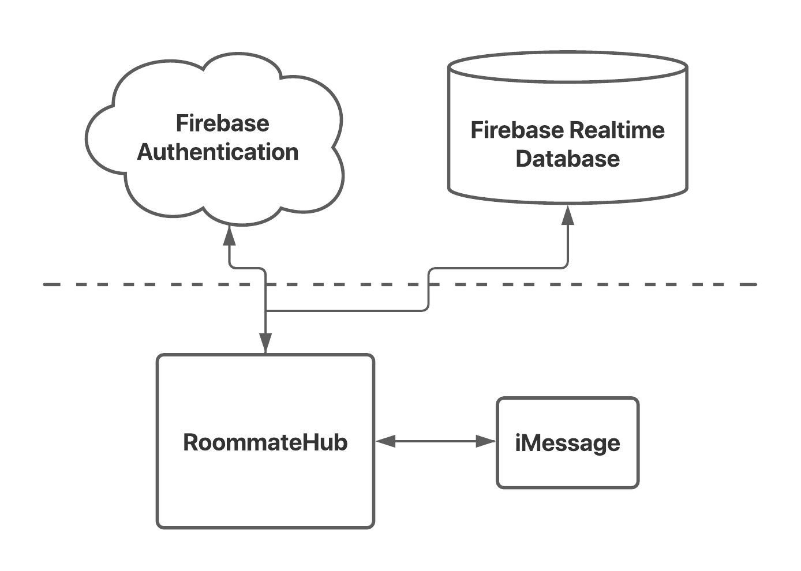
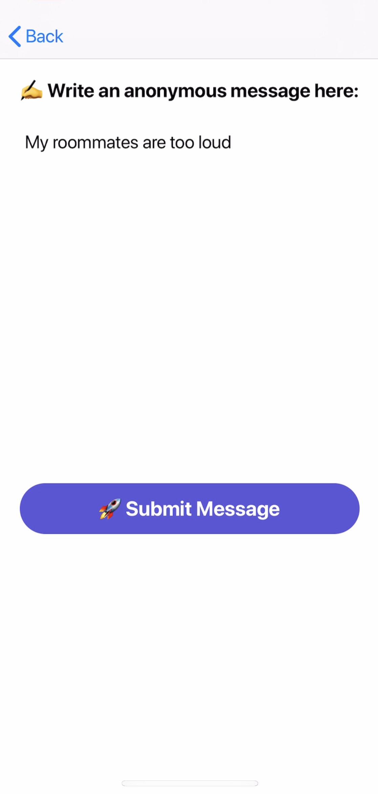

# RoommateHub

**Authors**: Jeremy Hsu and Geena Kim

RoommateHub is an iOS app designed to improve the shared living experience by
enabling roommates to coordinate tasks, learn more about each other, and send
each other direct messages.

  
  
  

**Note**: This project was originally written as our CS 50 project in Fall 2019.
The `README.md` and `DESIGN.md` files written as part of the original course
project write-up can be found in the `Documentation` folder.

## Architecture Overview

RoommateHub is written in Swift and UIKit and uses the 
[Firebase Realtime Database](https://firebase.google.com/docs/database) as the
primary data store, [Firebase Authentication](https://firebase.google.com/docs/auth)
for user login and creation,  and 
[MessageUI](https://developer.apple.com/documentation/messageui) to embed 
iMessage into the app. The high-level architecture of RoommateHub is as follows:

## Full Walkthrough

When you open the app, you are greeted with the login page. If you do not have
an account, you can create one.

Once you sign in, you arrive at the home page.

Upon creating their account, each user gets their own roommate profile. They
can view the profiles of their other roommates in addition to their own.

You can also send an SMS or iMessage to a roommate right from their profile page,
assuming they provided their phone number.

You can also post to an anonymous message board, or set tasks that anyone in the
room can accomplish.

